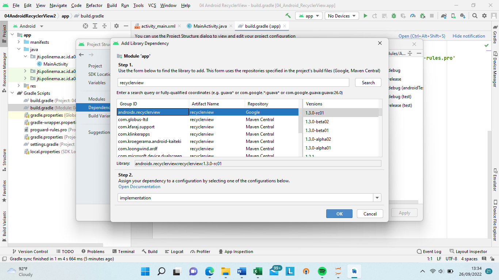
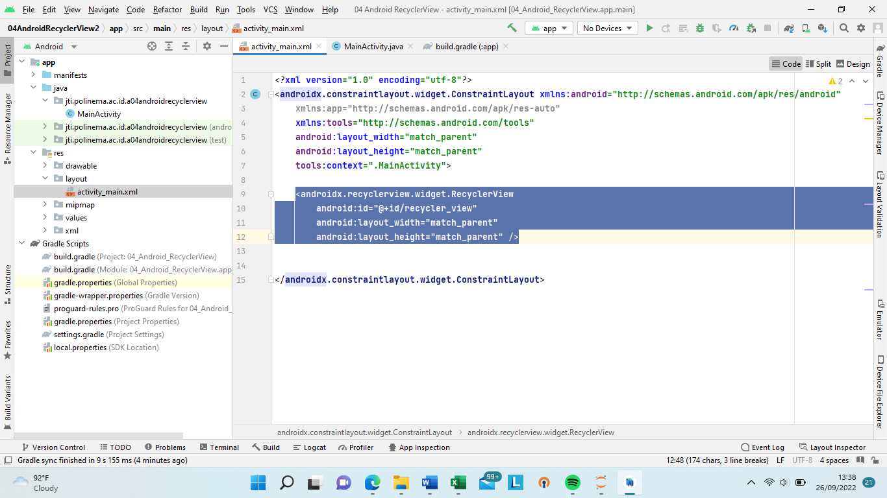
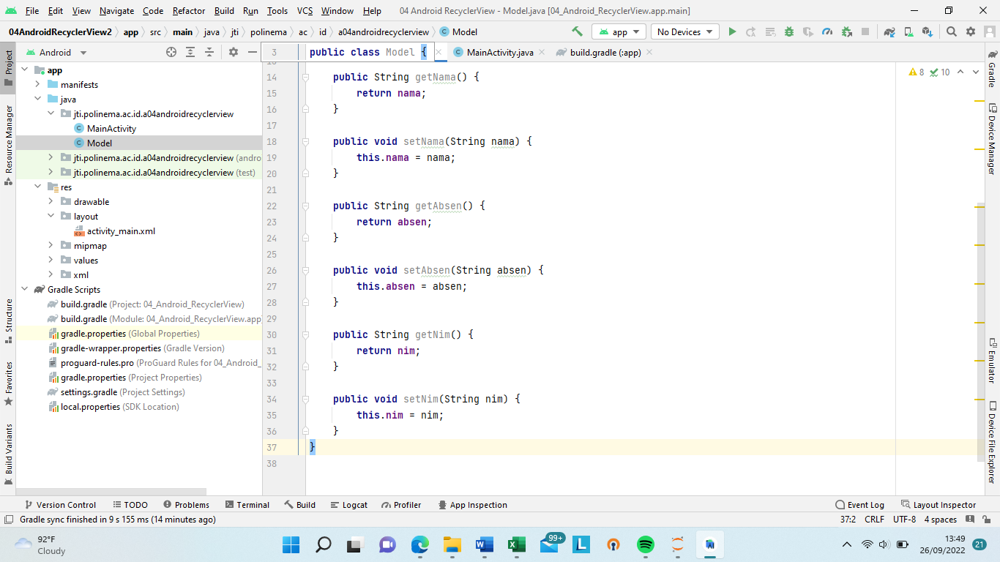
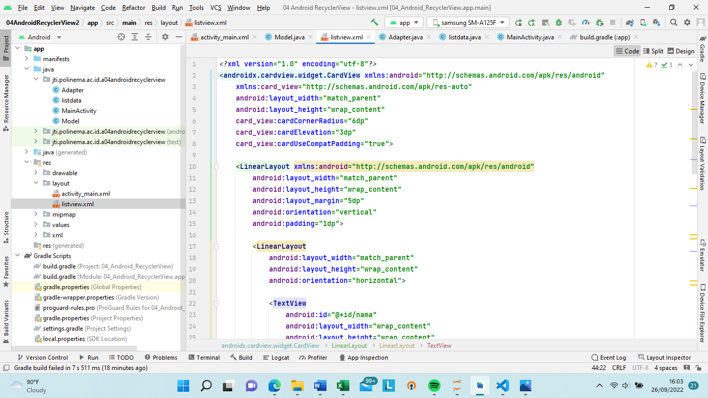
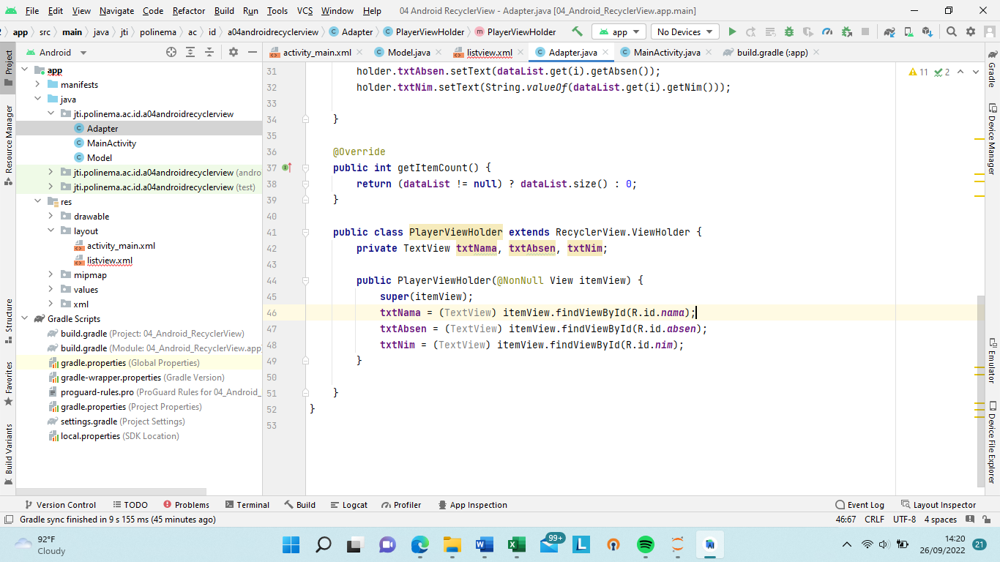
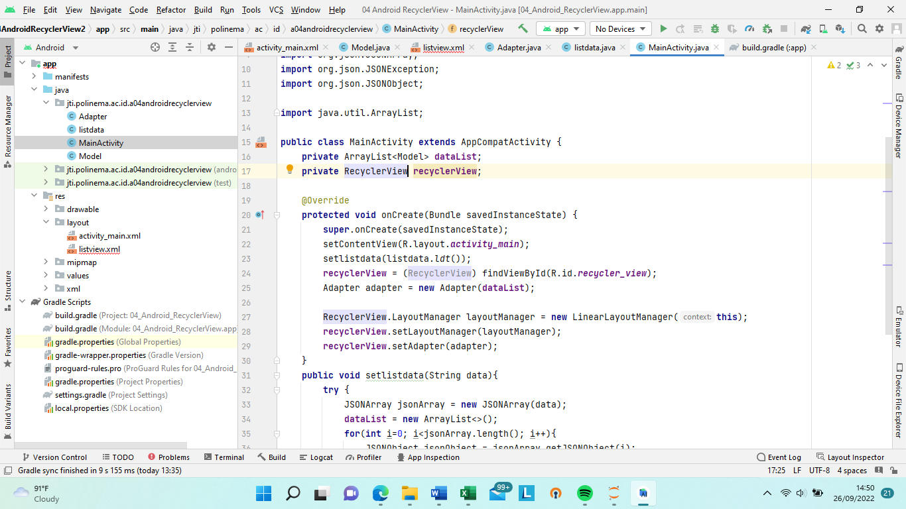
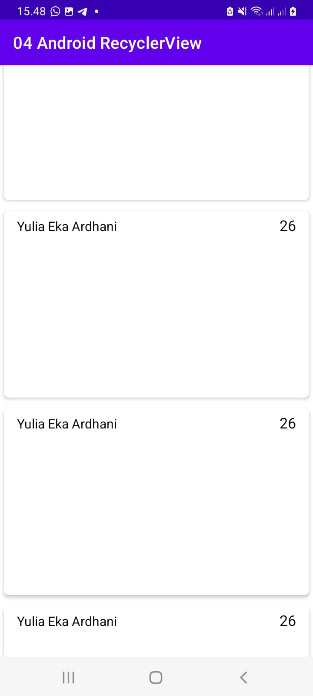

# JOBSHEET 04 RECYCLER VIEW ANDROID STUDIO
Nama : Yulia
1. Menambah dependency di file gradle

Selanjutnya pada file xml di layout activity, gunakan juga elemen RecyclerView seperti pada kode dibawah ini:

2. Membuat Class model

3. Layout item list

4. Membuat Adapter

5. HASIL

